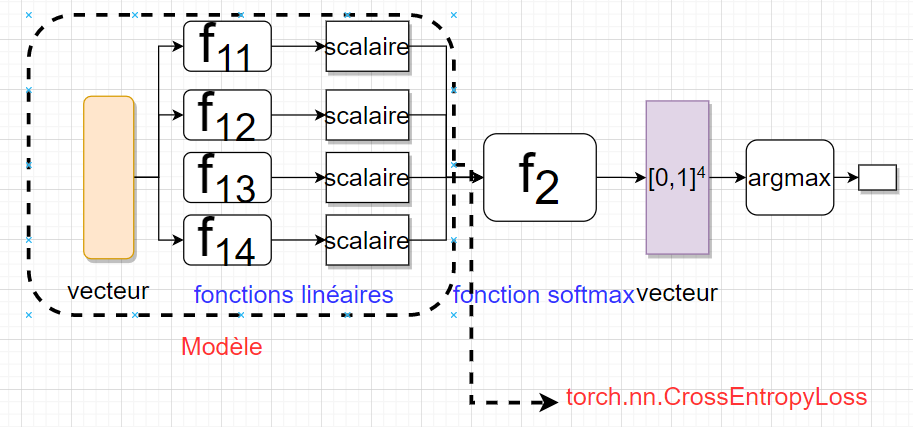
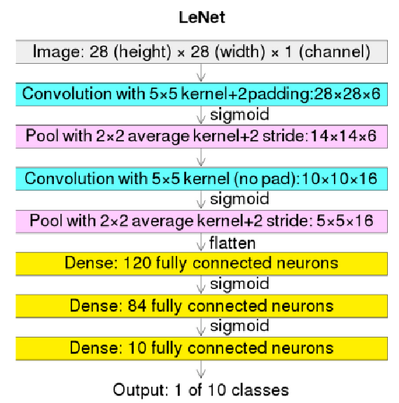

# TP Pytorch Image Classification

## Etapes premilinaires
- Télécharger ce dossier
- Installer [PyTorch](https://pytorch.org/get-started/locally/)

# Exercices:
## 1. Familiarisez-vous avec votre jeu de données : [mnist](https://fr.wikipedia.org/wiki/Base_de_donn%C3%A9es_MNIST)
### Questions:
- Quelle est la taille des images ? Quelle est la taille totale de ce jeu de données ?
   - Chaque image : 28*28*1 (blanc et noir)
   - 10 classes 
   - 60,000 images pour l'entrainement et 10,000 images pour le test
- Comment ce jeu de données est-il lu par PyTorch ? Quel package a été utilisé ? (indice : get_dataloader.py)
   - torchvision.datasets

## 2. Consulter le fichier `args.py`, qui est utilisé pour lire les arguments nécessaires au lancement du programme.
### Questions:
- Quels sont les arguments ?
- À quoi sert chaque argument ?
## 3. Ajouter le modèle linaire dans`get_model.py` pour mnist

## 4. Écrire la boucle d'entraînement dans`main.py`
## 5. Évaluer les précisions du modèle sur les jeux de données d'entraînement et de test en utilisant la fonction `metric`.
## 6. Test le code `python main.py --experiment mnist --model linear`
## 7. Ajouter le modèle de réseau de neurons entièrement connecté 
(vous pourrez configurer le nombre de couches et neurons)
## 8. Ajouter le modèle de réseau de neurones convolutifs LeNet avec la structure suivante :

## 9. Comparer les performances des différents modèles
Remarque : Il est nécessaire de rechercher les meilleurs hyperparamètres (par exemple, le nombre d'époques, le taux d'apprentissage) pour chaque modèle.
## 10. Ajouter le jeu de donnée [Fashion MNIST](https://fr.wikipedia.org/wiki/Fashion_MNIST)